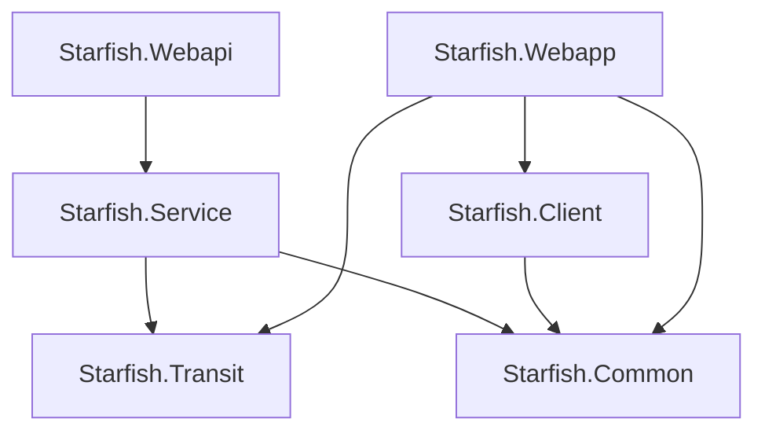

# Overview/概览 ⚡

[]()
[](LICENSE)
[]()
[]()

Starfish is a lightweight powerful distributed configuration server for .NET application.

Starfish是一个轻量但功能强大的分布式 .NET 应用程序配置中心。

## ⌨️ Features/功能

> 💚 Completed/已完成 ⌛ In progress/进行中 🕝 Planned/计划中

- [ ] ⌛ Support multiple data sources/支持多种数据源
    - [x] 💚 MySQL
    - [ ] ⌛ SqlServer
    - [x] 💚 PostgreSQL
    - [ ] 🕝 MongoDB
    - [x] 💚 Sqlite
- [x] 💚 Support multiple platforms/支持多种平台
    - [x] 💚 Web API/Web Application/gRPC Service in .NET6/7/8
    - [x] 💚 .NET MAUI
    - [x] 💚 WPF application
- [ ] 🕝 Support multiple node deployment/支持多节点部署
- [x] 💚 Support multiple environments/支持多环境
- [ ] ⌛ Deploy with docker/支持Docker部署
- [x] 💚 Support client cache/支持客户端缓存
- [ ] ⌛ Multiple protocols support/支持多种协议
    - [x] 💚 HTTP
    - [ ] 🕝 gRPC
    - [x] 💚 WebSocket
- [x] 💚 Sync configuration to Redis server. / 同步配置到Redis服务器。
- [ ] 🕝 Rollback to history version/回滚到历史版本
- [ ] 🕝 Role-based access control/基于角色的访问控制
- [x] 💚 Support multiple languages admin panel/支持多语言管理面板
    - [x] 💚 en/英语
    - [x] 💚 zh-Hans/简体中文
    - [x] 💚 zh-Hant/繁体中文
    
## 💰 Donate/捐助 
 

**Paypal**

[](https://www.paypal.me/realzhaorong)

[https://www.paypal.me/realzhaorong](https://www.paypal.me/realzhaorong)

---

> If you like my work, you can support me by donation. / 如果您喜欢我的工作，可以通过捐赠来支持我。

## 📨 Contact and Suggestions/联系与建议

Any feedback is welcome, you can create a issue, or contact us by email, thank you.

非常乐意收到您的任何反馈，您可以创建一个 issue，或通过邮件联系我们，谢谢。

> [zhaorong@outlook.com](mailto:zhaorong@outlook.com)

## 🔑 License/许可证

This project is licensed under the AGPL-3.0 License - see the [LICENSE](LICENSE) file for details.

本项目采用 AGPL-3.0 协议，可查看 [LICENSE](LICENSE) 了解更详细内容。


# Getting Started/快速开始 ⚡

## Solution structure/解决方案结构

```
Starfish
├──Source
├    ├──Starfish.Client
├    ├──~~Starfish.Agent~~
├    ├──Starfish.Common
├    ├──Starfish.Service
├    ├──Starfish.Transit
├    ├──Starfish.Webapi
├    ├──Starfish.Webapp
├──Tests
├    ├──Starfish.Client.Tests
├    ├──Starfish.Service.Tests
```

## Depdenencies Structure/依赖关系结构



## Requirements/环境要求

### Development/开发环境

IDE/开发环境
- Windows/Linux/MacOS
- Visual Studio/Visual Studio Code/Rider. Visual Studio for Mac is retired, so it's not recommended./Visual Studio for Mac 已经被微软弃用，所以不推荐使用。
- .NET 8 SDK.

Dependencies/依赖服务
- Redis 6 and above. It's required for distributed cache and distributed lock. / 如果您需要使用分布式缓存和分布式锁，那么Redis是必须的。
- MySQL/SQL Server/PostgreSQL/MongoDB, latest version recommended. The database service is used to store configuration data. Choose one that you are about to use for production. / 数据库服务用于存储配置数据。请选择您将要在生产环境中使用的数据库。
- RabbitMQ

Deploy & Run/部署与运行
- Docker & Docker Compose

### Production/生产环境

Runtime/运行环境
- Windows/Linux, CentOS/Ubuntu recommended.
- .NET 8 Runtime. It's not needed if running in container./如果您在容器中运行，那么您不需要安装.NET 8 Runtime。

Dependencies/依赖服务
- Redis 6 and above. It's required for distributed cache and distributed lock. / 如果您需要使用分布式缓存和分布式锁，那么Redis是必须的。
- MySQL/SQL Server/PostgreSQL/MongoDB, latest version recommended. The database service is used to store configuration data. Choose one that you are about to use for production. / 数据库服务用于存储配置数据。请选择您将要在生产环境中使用的数据库。
- RabbitMQ

Deploy & Run/部署与运行
- Docker & Docker Compose. As you can see, we recommend you to run Starfish in container. / 如您所见，我们建议您在容器中运行Starfish。

## Server/服务端

### Deploy/部署

```bash
docker pull nerosoft/starfish:latest
```

### Configuration/配置

```bash
```

## Client/客户端

### Install/安装

```bash
dotnet add package Starfish.Client
```

or

```powershell
Install-Package Starfish.Client
```

or

```xml
<PackageReference Include="Starfish.Client" Version="1.0.0" />
```

### Configuration/配置

1. Add Starfish as a configuration source in Program.cs/在 Program.cs 中添加 Starfish 作为配置源

```csharp
// .NET 5
public static IHostBuilder CreateHostBuilder(string[] args) =>
    Host.CreateDefaultBuilder(args)
        .ConfigureAppConfiguration((hostingContext, config) =>
        {
            config.AddStarfish(ConfigurationClientOptions.Load(config));
        })
        .ConfigureWebHostDefaults(webBuilder =>
        {
            webBuilder.UseStartup<Startup>();
        });
```
    
```csharp
// .NET 6 and above
var builder = WebApplication.CreateBuilder(args);
builder.Configuration.AddStarfish(ConfigurationClientOptions.Load(builder.Configuration));
// ...
var app = builder.Build();
// ...
app.Run();
```

2. Add configuration in appsettings.json/在 appsettings.json 中添加配置

```json
{
    "Starfish": {
        "Host": "http://localhost:5000",
        "App": "Starfish.Sample.Blazor",
        "Secret": "123456",
        "Env": "Development"
    }
}
```


# Documentation/文档 ⚡

## API

See the Swagger UI at [http://localhost:5229/swagger](http://localhost:5229/swagger) after running the server.

## Scripts/脚本

- MySQL: [SCRIPTS_MYSQL.md](Documents/SCRIPTS_MYSQL.md)
- SQL Server: [SCRIPTS_MSSQL.md](Documents/SCRIPTS_MSSQL.md)
- PostgreSQL: [SCRIPTS_PGSQL.md](Documents/SCRIPTS_PGSQL.md)
- Sqlite: [SCRIPTS_SQLITE.md](Documents/SCRIPTS_SQLITE.md)
- ~~Mongo: *not needed. / 不需要*~~

## Resources/资源

## Release Notes/发布日志

## FAQ/常见问题


# Roadmap/路线图 ⚡

## v1.0

 - Basic configuration management/基础配置管理
 - Web API
 - Basic admin panel/基础管理面板
 - Configuration client/配置客户端
 - WebSockets protocol support of Client. / 客户端支持WebSockets协议。

## v1.1
    
 - gRPC protocol support of Client. / 客户端支持gRPC协议。
 - Rollback to history version. / 回滚到历史版本。
 - Role-based access control. / 基于角色的访问控制。

## v1.2

 - Docker support. / 支持Docker部署。
 - MongoDB support. / 支持MongoDB。
 - User registration. / 用户注册。

## v1.3

 - Multiple node deployment. / 支持多节点部署。
 - Common configuration. / 公共配置。
 - Customized environments. / 自定义环境。

## v2.0

 - Service discovery. / 服务发现。

## v3.0

 - Service insights. / 服务监控。
 - Service tracing. / 服务追踪。
 - Log management. / 日志管理。


# Contributing/贡献 ⚡


# Acknowledgements/鸣谢 ⚡

[](https://www.jetbrains.com/)

Thanks to JetBrains for supporting the project through All Products Packs within their Free Open Source License program.

感谢JetBrains通过其免费开源许可计划中的所有产品包支持该项目。
